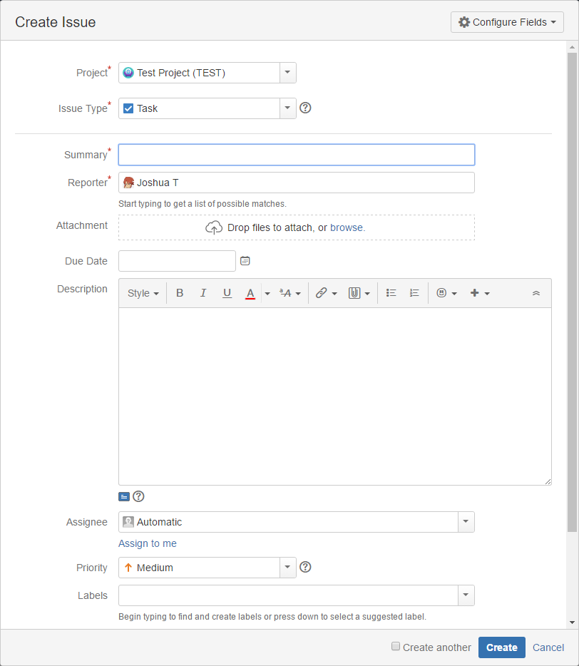

===============
Creating Issues
===============

In order to create a new issue in JIRA, you need to provide a certain amount of information about the issue. In the Web interface, you encounter this all the time when you hit the "Create Issue" button:

To create an issue using JiraPS, you need to provide this information as well. Before you can provide the needed information to create an issue, though, you'll need to know what information your JIRA instance requires! This can be dramatically different from one JIRA instance to the next, and even from one project to another.

Identifying "Create" Metadata
=============================

JiraPS includes a command to make discovering this metadata as simple as possible. You will need to provide both a project and an issue type to this function, because each project and issue type can be configured to accept or require different fields when creating issues.

.. code-block:: powershell

    Get-JiraIssueCreateMetadata -Project TEST -IssueType Task

There are quite a lot of fields that we can provide when we create a new issue!

This function returns any fields that we can provide when creating a new issue. Not all of these fields are required, though. We can use PowerShell's Where-Object cmdlet to filter for only the required fields:

.. code-block:: powershell

    Get-JiraIssueCreateMetadata -Project TEST -IssueType Task | ? {$_.Required -eq $true}

Creating An Issue
=================

Now that we know what fields we need to provide our JIRA instance, let's create an issue!

.. code-block:: powershell

    New-JiraIssue -Project TEST -IssueType Task -Reporter 'powershell' -Summary 'Test issue from PowerShell' -Credential $myJiraCreds

This might be all the information we would need to pass New-JiraIssue to create a new JIRA issue. We can do much more, though:

.. code-block:: powershell

    New-JiraIssue -Project TEST -IssueType Task -Reporter 'powershell' -Summary 'Test issue from PowerShell' -Description "This is a sample issue created by $env:USERNAME on $env:COMPUTERNAME." -Labels 'Test','Fake' -Credential $myJiraCreds

.. note:: You don't need to pass your credentials to JIRA every time you run New-JiraIssue. See the :doc:`authentication` page for details.

Additional Fields
=================

In most JIRA instances, the default fields are not the only fields necessary when creating an issue. Most organizations have additional information they track in JIRA through the use of custom issue fields.

New-JiraIssue provides the -Fields parameter for working with these custom fields:

.. code-block:: powershell

    New-JiraIssue -Fields @{'customfield_10001'='foo'} # Other New-JiraIssue parameters

For more information on the -Fields parameter, see the :doc:`custom_fields` page.
